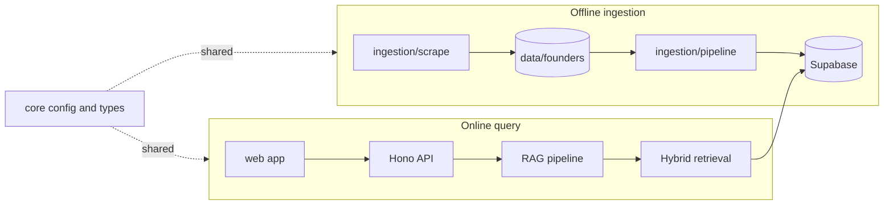

# Pod-Scribe

Pod-Scribe is a Bun + TypeScript project that ingests Founders podcast transcripts, stores chunked embeddings in Supabase, and serves a chat/search interface over that corpus.

## What it does

- Scrapes transcript pages into local JSON files under `data/founders/episodes`.
- Chunks and embeds transcript text, then upserts it into Supabase.
- Runs hybrid retrieval (vector + keyword via RRF).
- Synthesizes answers with citations through a streaming chat API.
- Provides a React web UI for conversations and source inspection.

## Architecture

## Prerequisites

- Bun
- Node-compatible environment variables
- Remote Supabase project with the schema in `supabase/migrations`
- OpenRouter API key

## Environment

Copy `.env.example` to `.env` and set values:

- `SUPABASE_URL`
- `SUPABASE_SERVICE_ROLE_KEY` (server-side only, never expose in browser code)
- `OPENROUTER_API_KEY`

## Common commands

- `bun run dev` - run API and web app together
- `bun run dev:server` - run API only
- `bun run dev:web` - run web app only
- `bun run build` - build web app
- `bun run start` - run production server entrypoint
- `bun run scrape` - scrape one episode slug (default if no slug is passed)
- `bun run scrape:batch` - scrape first N slugs from page 1
- `bun run scrape:all` - crawl all listing pages with retry and resume
- `bun run ingest` - ingest unprocessed episodes into Supabase
- `bun run search -- \"<query>\"` - run hybrid retrieval via CLI
- `bun run ask -- \"<question>\"` - run non-streaming RAG answer via CLI

## Source layout

- `src/core` - shared config, embeddings client, and shared types
- `src/db` - Supabase client and table upsert helpers
- `src/ingestion` - scrape/chunk/embed/ingest pipeline
- `src/retrieval` - hybrid search and retrieval context formatting
- `src/rag` - prompt strategy and answer generation
- `src/server` - Hono API routes and middleware
- `src/web` - React client
