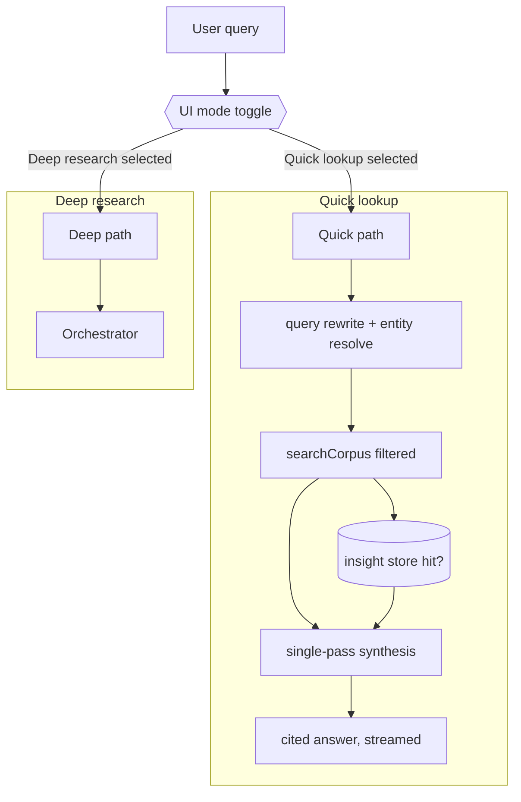
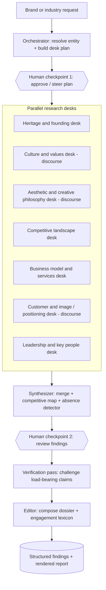

# Fashion Intelligence: Deep Research Agent Architecture

Design-only. This converges the nine candidates in [plan/deep-agent.md](plan/deep-agent.md) into a single recommended composite tailored to the fashion-intelligence goal, and adds the two things that doc never addressed: a bimodal (quick vs deep) entry point selected by a **manual UI toggle** (no auto-classifier) and an entity-aware retrieval layer for an expanding, multi-topic corpus.

## Recommendation in one sentence

The chat UI exposes a **manual mode toggle** so you pick the path per query (no auto-classifier): **Quick lookup** = the existing single-pass RAG (improved), **Deep research** = an **Orchestrator-Worker "research desk" system** that decomposes a brand/industry into parallel desks, runs a dedicated discourse/mindspace pass, verifies load-bearing claims, and composes a **mindspace dossier + engagement lexicon**. Both paths share one entity-tagged retrieval layer.

## Why this pattern (and not the more exotic candidates)

- The goal is **profiling along known dimensions** (culture, values, competitive landscape, services, image). When the dimensions of value are known up front, **decomposition into parallel desks** (the Newsroom architecture) dominates undirected exploration (Dream / Evolutionary / Immune), which shine only when you do not know what you are looking for. You told us exactly what you are looking for.
- Orchestrator-Worker is the **lowest-complexity, highest-leverage** way to get breadth (parallel desks) + depth (each desk drills its slice) + controllability (natural human checkpoints) + composability (add/remove desks). It is also the proven pattern for multi-agent research.
- It is **bimodal-friendly**: quick mode is literally "skip the orchestrator, run one desk." Both modes share one retrieval tool, and the user picks which mode runs, so there is no misclassification risk and cost/latency stay predictable.
- The best ideas from the other candidates survive as **components, not competitors**: the Spectral "low-frequency" pass becomes the discourse desk; the Absence detector becomes a synthesis step; the Adversarial dialectic shrinks to a lightweight verification pass; the Semantic graph becomes optional competitive-landscape enrichment.

## Foundation: the entity-aware retrieval layer

Because the corpus will grow with new fashion-dedicated transcripts on many topics, retrieval must move beyond today's `founders_*` schema and the **filter-less** `hybrid_search` RPC in [supabase/migrations/00002_rename_chunks.sql](supabase/migrations/00002_rename_chunks.sql).

- **Generalized corpus schema**: `sources` (a podcast / interview series / brand channel) -> `episodes` -> `chunks`, replacing the founders-specific naming. Keep the proven pgvector + RRF design from [src/search/search.ts](src/search/search.ts); just generalize the tables.
- **Entity + topic tagging**: tag every episode (and ideally every chunk) with brands/houses, people, and a topic label (e.g. `fashion`, `not-fashion`). This is what makes "deep research on a particular brand" possible and lets either mode scope a search to a single house or to fashion-only.
- **A filtered search tool**: a new `hybrid_search` variant accepting `filters: { source?, brand?, person?, topic?, dateRange? }`. This is the single tool every agent calls: `searchCorpus({ query, filters, topK })`.
- **A brand/entity catalog**: the canonical set of houses the system can profile (Chanel, Dior, LVMH, Hermes, Cucinelli, Lauder, Balenciaga, Rolex, ...), with aliases, so "research LV" resolves to Louis Vuitton/LVMH. The existing corpus already seeds this: Chanel (`#64`, `#199`), Dior (`#331`), Balenciaga (`#315`), Ralph Lauren (`#288`), Cucinelli (`#289`), Arnault/LVMH (`#296`, `#355`), Wintour (`#326`), Rolex (`#351`), Lauder (`#136`, `#217`, `#361`).
- **An insight store** (`research_findings`): every deep-research run writes structured, cited findings back to the DB. Emergent payoff: **deep research feeds quick lookup** -> over time, quick answers can hit pre-mined findings first, so the system gets faster and richer the more you use it.

## The two modes

Mode selection is **manual**: a toggle in the chat input ([src/web/components/InputBar.tsx](src/web/components/InputBar.tsx)) lets you pick Quick or Deep per query. There is no auto-classifier, so behavior is predictable and you stay in control of cost and latency. The selected mode is sent to the server (e.g. a `mode` field on the existing `/api/chat` request) which dispatches to the right pipeline.

### Mode 1 - Quick lookup (the fast path)

Essentially today's `askStream` in [src/rag/pipeline.ts](src/rag/pipeline.ts), upgraded with: entity resolution + query rewrite before search, metadata-filtered `searchCorpus`, and an insight-store lookup. Latency is the priority; one retrieval, one synthesis, streamed with citations. Reuses the existing Hono SSE + React chat UI unchanged.

### Mode 2 - Deep research (Orchestrator-Worker)

1. **Plan (Orchestrator)** - resolves the request to a brand or an industry via the entity catalog, then emits a research plan: which desks to run and the sub-questions for each. **Human checkpoint 1** (highest-leverage pause): approve, drop, or refocus desks.
2. **Parallel desks (Workers)** - each desk is a sub-agent with its own context window and the `searchCorpus` tool, issuing several sub-queries scoped to the brand. Independent contexts avoid context dilution (the core multi-agent benefit). Each finding is structured: `claim + evidence quotes + citation + confidence + insightType (topic | discourse) + crossSourceRefs`.
3. **Synthesis** - merges desk outputs, builds the competitive map (this house vs neighbors), surfaces tensions/contradictions, and runs the **Absence detector** ("what does this house never talk about / never compromise on" - high value for mindspace). **Human checkpoint 2**: review before composition.
4. **Verification (lightweight adversary)** - challenges only high-confidence, load-bearing claims; drops unsupported ones; flags thin evidence. This is the Adversarial Dialectic shrunk to a finishing pass, not a recursive loop.
5. **Compose (Editor)** - produces the final artifact (below) and writes structured findings to the insight store.

## Desk ontology (composable)

Desks map directly to your stated dimensions. Three are **discourse desks** (the Spectral "low-frequency" pass) because culture/aesthetic/image require surfacing what is *assumed and unsaid*, not just stated:

- Heritage and founding (topic)
- Culture and values (discourse)
- Aesthetic and creative philosophy (discourse)
- Competitive landscape (topic + graph)
- Business model and services (topic)
- Customer and image / positioning (discourse)
- Leadership and key people (topic)

Industry mode reuses the same desks but scopes them to a set of brands and adds a cross-brand comparison desk.

## The output that serves the business goal

"To reach them, speak their language." The differentiator is a two-part artifact:

- **Mindspace dossier** - the brand's worldview, values, sacred cows, taboos, status signals, how they frame craft/heritage/innovation, competitive position, services, and projected image - all cited to transcript timestamps.
- **Engagement lexicon** - an actionable brief distilled from the discourse desks: their vocabulary, what resonates vs what reads as vulgar, what to say and what never to say when approaching them. This is the piece that turns understanding into outreach.

Both are emitted as **structured JSON intermediates** (browseable as a database, queryable by quick mode) plus a **rendered report**, satisfying the flexible-output requirement from [plan/deep-agent.md](plan/deep-agent.md).

## Model and infra strategy

- Keep OpenRouter + Vercel AI SDK (`generateText` / `streamText`, with tool-calling + multi-step for workers). Stay on the existing Hono SSE + React stack.
- **Per-role models**: fast/cheap (today's `google/gemini-3-flash-preview`) for quick-mode synthesis and worker extraction; a stronger reasoning model for orchestrator planning, synthesis, and verification. Make this a config knob in [src/config.ts](src/config.ts).
- Deep runs are stateful and slow-by-design (matches "Dreamy Elephant"): persist plan, desk findings, and synthesis so runs are resumable across the two human checkpoints.

## How this refines deep-agent.md

- Collapses 9 standalone candidates into **one recommended composite**: Newsroom orchestrator-worker spine + Spectral discourse desks + Absence detector + lightweight Adversarial verification + optional Semantic-graph competitive enrichment.
- Adds the **bimodal entry point** (a manual quick/deep UI toggle, no classifier) the original doc omitted.
- Adds the **entity-aware retrieval + insight-store** layer the original doc assumed away.
- Replaces the generic "insight corpus" output with the domain-specific **mindspace dossier + engagement lexicon**.
- Keeps the doc's strongest constraints: human checkpoints at plan and synthesis, structured cited findings, and the absence detector in every run.